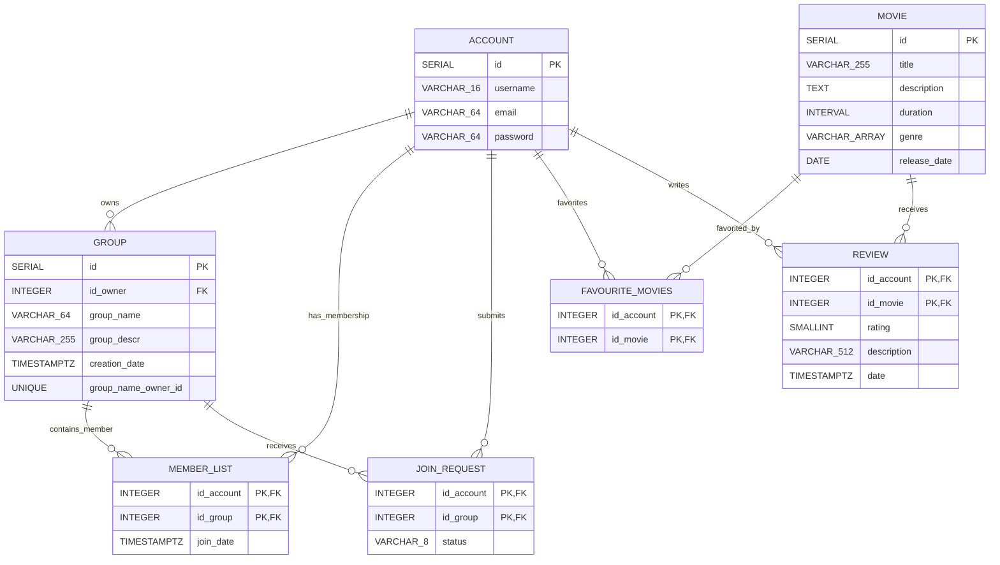
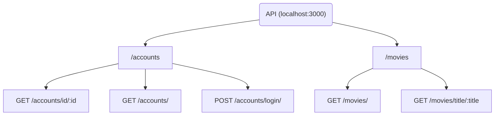

# The Red Carpet
The project assignment is to develop a website for movie enthusiasts.

The application will make use of the open-data sources mentioned later. The browser-based part of the application will be implemented using React, and the server will be built with Node. PostgreSQL will be used as the database.

The open-data API to be used is [The Movie Database](https://developer.themoviedb.org/reference/intro/getting-started), which contains a large amount of open data related to movies. Using the API requires registration, after which the necessary API key/token can be obtained.

# Tools
- Swagger
- pgAdmin
- Github:
- Visual Studio Code:
- PostgreSQL

# Documentation

## UI-Design

## Tech stack / application architecture
REST API - Node.js/Express\
Frontend - JS React\
Database - PostgreSQL

## ERD

## API

## Login requirements
- User email works as an username
- User email can be max 64 characters
- Password requirements:
    - 8-64 characters
    - Must contain one uppercase letter
    - Must contain one number
